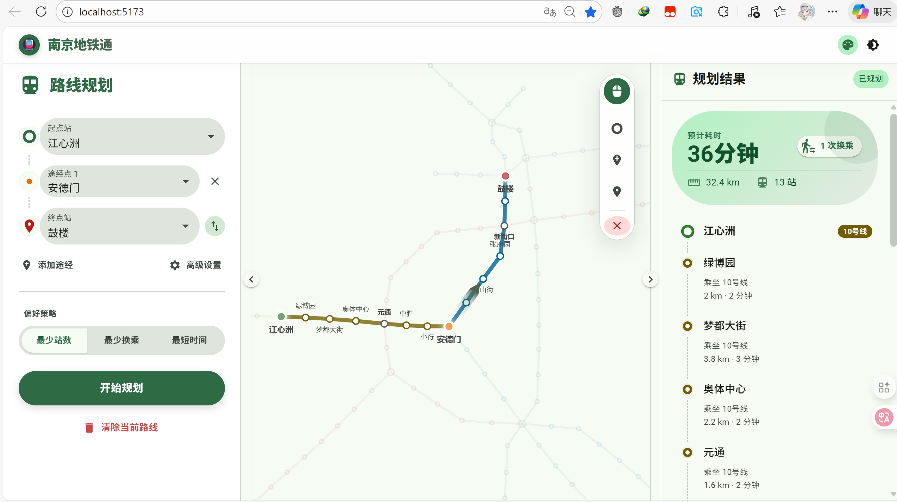
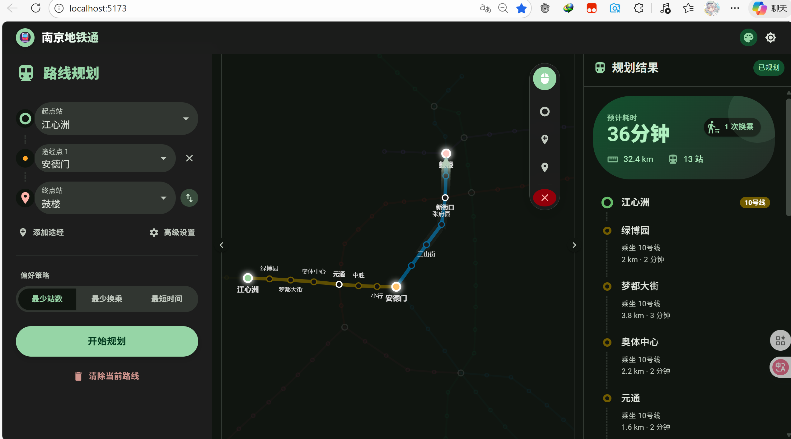
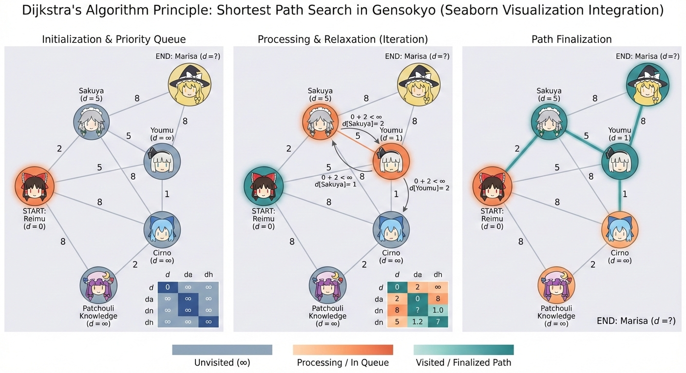

# 🚇 南京地铁通 (Nanjing Metro Master)

> 2025/12 南京邮电大学数据结构大作业

> 使用 **React** 与 **TypeScript** 构建，遵循 **Material Design 3** 现代美学南京地铁路线规划应用demo。




## 功能
- [x] 最少站数、最少换乘与最短时间三种路径规划算法
- [x] 带有**途径站**约束规划
- [x] 求解结果的美观显示
- [x] 地图视图的友好交互
- [x] `MD3` 动态主题、静态主题、深色模式支持

## ✨ 设计理念 (UI & UX)

本项目致力于打造极致的视觉体验与交互流畅度，完全遵循 **Material Design 3 (MD3)** 规范。

### 动态主题与色彩
应用内置了强大的主题引擎，支持 **动态取色** 与 **深色模式**。
*   **MD3 语义色**: 界面颜色并非硬编码，而是基于种子色（Seed Color）动态生成的 Tonal Palette。
*   **沉浸式体验**: 无论是“南京蓝”还是“梧桐黄”，UI 控件都会随主题色自动适配，保持视觉的一致性与和谐感。

### 质感与动效
*   **毛玻璃**: 侧边栏与悬浮工具栏采用 `backdrop-filter` 模糊处理，营造通透的层级感。
*   **微交互**: 按钮的缩放、面板的展开、路径的绘制均包含细腻的过渡动画。
*   **胶囊设计**: 摒弃生硬的直角，大量使用 Pill-shaped 与 Rounded 容器，手感温润。

### 深色模式


## 核心算法

不仅仅是好看，我们构建了严谨的图论算法服务来解决复杂的地铁换乘问题。




*   **最少站数 (BFS)**: 利用广度优先搜索的层级特性，快速寻找经过站点最少的路径。
*   **最少换乘 (Weighted Dijkstra)**: 通过**状态空间扩展**，将“换乘”视为高权重的边。
*   **最短时间 (Time Model)**: 引入物理距离、列车均速、停站时间（T1/T2）与换乘耗时（T3）模型。

## 🛠️ 技术栈

*   **核心框架**: React 18 + TypeScript + Vite
*   **UI 组件库**: MUI (Material UI) v5 + Emotion
*   **可视化**: ECharts (高性能 Canvas 渲染)
*   **图标**: MUI Icons Material

## 🚀 快速开始

1.  **克隆项目**
    ```bash
    git clone https://github.com/lux-QAQ/nanjing-metro-app.git
    ```

2.  **安装依赖**
    ```bash
    npm install
    ```

3.  **启动开发服务器**
    ```bash
    npm run dev
    ```

---

Designed with ❤️ in Nanjing.


## License

This project is licensed under the Creative Commons Attribution-NonCommercial 4.0 International License. You can view the full license [here](LICENSE).
根据该License严禁将该项目用于任何商用目的。